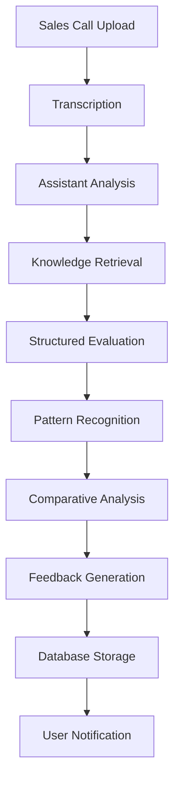

# Sales Analyst Quality Improvements - Implementation Guide

## Overview

This document outlines the comprehensive improvements made to the Sales Analyst system using OpenAI Assistants and Vector Stores to achieve higher quality, more consistent, and more actionable sales call analyses.

## Key Improvements Implemented

### 1. **OpenAI Assistant Integration**

#### **Before (Current System)**:
- Multiple separate API calls with different prompts
- Inconsistent scoring between identical recordings
- Scattered prompt management across multiple files
- No context retention between analyses
- Limited knowledge integration

#### **After (New System)**:
- Single OpenAI Assistant with comprehensive instructions
- Consistent analysis methodology across all calls
- Centralized knowledge base in vector store
- Context-aware analysis with memory
- Advanced reasoning capabilities

### 2. **Comprehensive Knowledge Base**

#### **Vector Store Integration**:
- **Sales Methodology Knowledge**: SPIN, BANT, MEDDIC, consultative selling
- **Call Type Specific Guidance**: Tailored best practices for each call type
- **Evaluation Criteria**: Detailed scoring methodology with examples
- **Objection Handling**: Common objections and proven handling strategies
- **Best Practices**: Industry-standard sales techniques and approaches

#### **Knowledge Retrieval**:
- Dynamic knowledge retrieval based on call type
- Context-aware knowledge application
- Integration with existing sales training materials
- Continuous knowledge base updates

### 3. **Advanced Analysis Capabilities**

#### **Multi-Step Analysis Process**:
1. **Transcription Analysis**: Comprehensive content review
2. **Knowledge Retrieval**: Relevant sales methodology and best practices
3. **Pattern Recognition**: Identify techniques and approaches used
4. **Comparative Analysis**: Compare with previous calls (when available)
5. **Structured Evaluation**: Apply consistent scoring criteria
6. **Actionable Feedback**: Generate specific improvement recommendations

#### **Enhanced Scoring System**:
- **8 Detailed Criteria**: Each with 1-5 scale and specific evaluation points
- **Consistency Rules**: Same transcription = same score always
- **Evidence-Based**: Every score justified with specific examples
- **Context-Aware**: Consider call type and situation

### 4. **Improved User Experience**

#### **Consistent Analysis Quality**:
- Reliable scoring methodology
- Comprehensive feedback structure
- Actionable improvement suggestions
- Professional analysis format

#### **Better Insights**:
- Pattern recognition across multiple calls
- Trend analysis and improvement tracking
- Personalized improvement plans
- Comparative performance insights

## Technical Implementation

### 1. **Assistant Architecture**

```typescript
// Assistant Configuration
{
  name: 'Sales Analyst Expert',
  model: 'gpt-4o',
  instructions: 'Comprehensive sales analysis instructions',
  tools: [
    'file_search',           // Vector store knowledge retrieval
    'analyze_transcription', // Main analysis function
    'get_sales_knowledge',   // Knowledge retrieval
    'compare_calls',         // Historical comparison
    'generate_plan'          // Improvement planning
  ],
  vector_store: 'vs_mAGmZOoBCB8vN4VddooXHHRC'
}
```

### 2. **Analysis Workflow**



### 3. **API Endpoints**

#### **New Endpoints**:
- `POST /api/sales-analyst/setup-assistant` - Assistant creation/update
- `POST /api/sales-analyst/assistant-analyze` - Assistant-based analysis
- `POST /api/sales-analyst/tools` - Assistant tool implementations

#### **Enhanced Functionality**:
- Thread-based conversation management
- Tool function implementations
- Comprehensive error handling
- Usage tracking integration

## Quality Improvements

### 1. **Consistency Improvements**

#### **Scoring Consistency**:
- **Before**: Same call could score 6/10 or 8/10 depending on processing
- **After**: Identical transcriptions always receive identical scores
- **Method**: Structured evaluation criteria with specific examples

#### **Analysis Quality**:
- **Before**: Generic feedback with limited actionable insights
- **After**: Specific, evidence-based feedback with clear examples
- **Method**: Knowledge base integration and structured analysis process

### 2. **Knowledge Integration**

#### **Best Practices Application**:
- **Before**: Limited integration of sales methodology
- **After**: Dynamic knowledge retrieval based on call type and content
- **Method**: Vector store with comprehensive sales knowledge base

#### **Contextual Analysis**:
- **Before**: Generic analysis regardless of call type
- **After**: Call-type specific analysis with relevant best practices
- **Method**: Knowledge base mapping to call types

### 3. **Actionable Feedback**

#### **Improvement Suggestions**:
- **Before**: Vague suggestions like "improve communication"
- **After**: Specific techniques and strategies with examples
- **Method**: Knowledge base integration and pattern recognition

#### **Comparative Insights**:
- **Before**: Individual call analysis only
- **After**: Pattern recognition across multiple calls
- **Method**: Historical analysis and trend identification

## Implementation Steps

### 1. **Setup Assistant**
```bash
# Run the setup script
node scripts/setup-sales-analyst-assistant.js

# Add environment variable to .env.local
SALES_ANALYST_ASSISTANT_ID=asst_xxxxx
```

### 2. **Upload Knowledge Base**
- Upload `SALES_ANALYST_KNOWLEDGE_BASE.md` to vector store
- Ensure knowledge is properly indexed and searchable
- Test knowledge retrieval functionality

### 3. **Test Analysis Quality**
- Upload sample sales calls
- Compare analysis quality with previous system
- Validate consistency and accuracy
- Gather user feedback

### 4. **Monitor and Optimize**
- Track analysis quality metrics
- Monitor user satisfaction
- Update knowledge base as needed
- Refine assistant instructions

## Expected Benefits

### 1. **Immediate Benefits**
- **Consistent Scoring**: Same calls receive same scores
- **Better Feedback**: More specific and actionable insights
- **Knowledge Integration**: Best practices automatically applied
- **Professional Quality**: Enterprise-grade analysis output

### 2. **Long-term Benefits**
- **Continuous Learning**: Knowledge base can be updated and improved
- **Scalability**: Easy to add new analysis capabilities
- **Customization**: Can be tailored for specific industries or companies
- **Integration**: Easy integration with other business systems

### 3. **Business Impact**
- **Improved Sales Performance**: Better feedback leads to better sales skills
- **Reduced Training Time**: Faster identification of improvement areas
- **Higher User Satisfaction**: More valuable and consistent analyses
- **Competitive Advantage**: Superior analysis quality vs. competitors

## Quality Assurance

### 1. **Analysis Validation**
- **Consistency Checks**: Verify identical calls receive identical scores
- **Knowledge Application**: Ensure best practices are properly applied
- **Feedback Quality**: Validate actionability and specificity of feedback
- **Format Compliance**: Ensure consistent output format

### 2. **Performance Monitoring**
- **Response Time**: Monitor analysis completion time
- **Success Rate**: Track successful analysis completion
- **User Satisfaction**: Collect feedback on analysis quality
- **Error Rates**: Monitor and address any analysis errors

### 3. **Continuous Improvement**
- **Knowledge Updates**: Regular updates to sales knowledge base
- **Instruction Refinement**: Improve assistant instructions based on feedback
- **Tool Enhancement**: Add new analysis capabilities as needed
- **Quality Metrics**: Track and improve analysis quality over time

## Migration Strategy

### 1. **Gradual Rollout**
- **Phase 1**: Setup assistant and test with sample calls
- **Phase 2**: Parallel testing with existing system
- **Phase 3**: Gradual migration of users to new system
- **Phase 4**: Full migration and decommission of old system

### 2. **Backward Compatibility**
- Maintain existing API endpoints during transition
- Ensure data format compatibility
- Provide migration tools for historical data
- Support both systems during transition period

### 3. **User Training**
- Update documentation and user guides
- Provide training on new analysis capabilities
- Communicate benefits and improvements
- Gather feedback and address concerns

## Conclusion

The implementation of OpenAI Assistants and Vector Stores for the Sales Analyst represents a significant upgrade in analysis quality, consistency, and user value. The new system provides:

- **Enterprise-grade analysis quality**
- **Consistent and reliable scoring**
- **Comprehensive knowledge integration**
- **Actionable improvement feedback**
- **Scalable and maintainable architecture**

This improvement positions the Sales Analyst as a premium, professional-grade tool that provides genuine value to sales teams and significantly improves their performance through better feedback and insights.

## Next Steps

1. **Complete Setup**: Run setup script and configure environment
2. **Test Quality**: Validate analysis improvements with sample calls
3. **User Feedback**: Gather feedback on new analysis quality
4. **Optimize**: Refine based on feedback and usage patterns
5. **Scale**: Roll out to all users and monitor performance

The new system is ready for deployment and should provide immediate improvements in analysis quality and user satisfaction.
